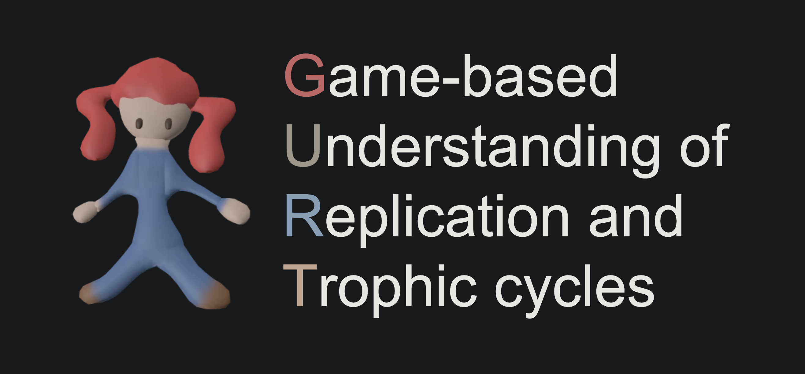
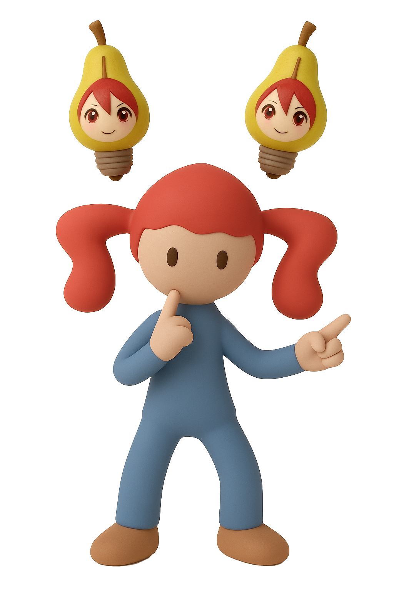
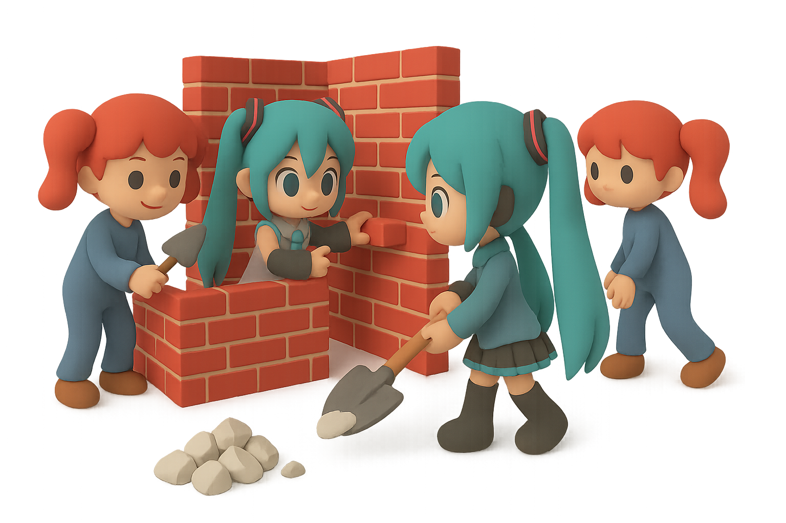

# Collective Intelligence Simulations



This repository showcases a series of simulations exploring various collective intelligence phenomena, implemented using the `vi` framework for agent-based modeling. The project delves into emergent behaviors such as flocking, aggregation, and predator-prey dynamics, drawing inspiration from natural systems.

Repository for the Project Collective Intelligence course at Vrije Universiteit.

## Table of Contents

* [Project Overview](#project-overview)
* [Key Features](#key-features)
* [Project Structure](#project-structure)
* [Getting Started](#getting-started)
    * [Prerequisites](#prerequisites)
    * [Installation and Running](#installation-and-running)
* [Simulations Overview](#simulations-overview)
    * [1. Flocking Phenomena](#1-flocking-phenomena)
    * [2. Aggregation Phenomena](#2-aggregation-phenomena)
    * [3. Agent-based Competition Modelling (Predator-Prey)](#3-agent-based-competition-modelling-predator-prey)
* [Project Documentation & Presentations](#project-documentation--presentations)
* [Authors](#authors)
* [License](#license)

## Project Overview

This project simulates complex collective behaviors in multi-agent systems. Agents in these simulations operate with only local sensing and without centralized control, self-organizing to achieve macroscopic patterns or objectives. The work is structured around three core assignments:

* **Flocking**: Modeling the classic Boids algorithm, focusing on alignment, cohesion, and separation.
* **Aggregation**: Investigating how agents gather in common locations, inspired by natural swarms, and the impact of environmental factors.
* **Predator-Prey Dynamics**: Exploring population fluctuations and survival mechanisms in an agent-based adaptation of the Lotka-Volterra model.

The simulations aim to provide insights into how simple local rules can give rise to sophisticated collective intelligence.

## Key Features



* **Agent-Based Modeling**: All phenomena are simulated using autonomous agents interacting based on local rules.
* **Diverse Collective Behaviors**: Covers classic flocking, self-organized aggregation, and ecological predator-prey dynamics.
* **Probabilistic Finite State Machines (PFSMs)**: Utilized in the aggregation model to govern agent state transitions.
* **Environmental Interactions**: Includes features like obstacle avoidance (flocking) and distinct aggregation sites/shelters.
* **Energy-Based Survival Mechanics**: Integrated into the predator-prey model to analyze its impact on population dynamics.
* **Configurable Parameters**: Each simulation offers tunable parameters to explore their influence on collective behavior.
* **Comprehensive Documentation**: Accompanied by detailed assignment PDFs and presentation slides outlining problem descriptions, methodologies, and experimental results.

## Project Structure

```
.
├── aggregation_task                          # Aggregation Assignment Files
    └── aggregation_v3.py                     # Latest version
├── flocking_task                             # Flocking Assignment Files
    └── flocking_v2.py                        # Latest version
├── hunter_prey_model_task                    # Hunter-prey Model Assignment Files
    └── hunter_prey_v3.py                     # Latest version
├── docs                                      # Project presenations
    ├── gurt_1_aggregation_presentation.pdf   # Presentation about the aggregation task
    └── gurt_2_hunter_prey_presentation.pdf   # Presentation about the hunter-prey model task
├── README.md                                 # This README file
├── task_descriptions                         # Specifics and requirements of tasks
└── images                                    # Directory for simulation sprites/assets
```

## Getting Started



To run these simulations, you will need a Python environment and the `vi` framework along with its dependencies.

### Prerequisites

* Python 3.13 or later (recommended for `vi` and type hints)
* `uv` (recommended for efficient dependency management and running scripts)

### Installation and Running

1.  **Install `uv` (if not already installed)**:
    Follow the installation instructions on the [uv documentation](https://docs.astral.sh/uv/getting-started/installation/).

2.  **Clone the repository**:
    ```bash
    git clone <your-repository-url>
    cd <your-repository-name>
    ```

3.  **Run a simulation**:
    Navigate to the project's root directory in your terminal and use `uv run` with the desired script name.

    * **For Flocking Simulation**:
        ```bash
        uv run flocking_v2.py
        ```
    * **For Aggregation Simulation**:
        ```bash
        uv run aggregation_v3.py
        ```
    * **For Predator-Prey Simulation**:
        ```bash
        uv run hunter_prey_v3.py
        ```

## Simulations Overview


Each simulation script includes comments explaining the logic and configurable parameters.

### 1. Flocking Phenomena

* **Script**: `flocking_v2.py`
* **Documentation**: `Assignment_0.pdf`
* **Description**: This simulation implements a classic Boids model, where agents (represented by triangles) move based on three core rules:
    * **Alignment**: Steer towards the average direction of local neighbors.
    * **Cohesion**: Steer towards the average position (center of mass) of local neighbors.
    * **Separation**: Steer away from local neighbors to avoid overcrowding.
    The simulation also incorporates obstacle avoidance, causing agents to turn away upon collision with static obstacles (`bubble-small.png`).
* **Key Configurable Parameters (`FlockingConfig`)**:
    * `alignment_weight`: Influence of alignment behavior.
    * `cohesion_weight`: Influence of cohesion behavior.
    * `separation_weight`: Influence of separation behavior.
    * `movement_speed`: Speed at which agents move.
    * `radius`: Perception radius for identifying neighbors.

### 2. Aggregation Phenomena

* **Script**: `aggregation_v3.py`
* **Documentation**: `Assignment_1_PCI.pdf`, `gurt_1_aggregation_presentation.pdf`
* **Description**: This simulation models how agents self-organize by gathering in common locations, inspired by the aggregation behavior of cockroaches. Agents navigate through different states defined by a Probabilistic Finite State Machine (PFSM):
    * **WANDERING**: Agents move randomly until they perceive sufficient neighbors or an aggregation site.
    * **JOINING**: Agents move towards a perceived aggregation site.
    * **STILL**: Agents remain at an aggregation site.
    * **LEAVING**: Agents move away from an aggregation site.
    The simulation explores how agents converge to a single shelter, the speed of convergence, and the impact of site size and perception radius.
* **Key Configurable Parameters (`CockroachConfig`)**:
    * `p_join_factor`: Factor influencing the probability of joining an aggregate ($P_{join}(n) = 1 - (1 / (1 + n \times p_{joinfactor}))$).
    * `p_leave_factor`: Factor influencing the probability of leaving an aggregate ($P_{leave}(n) = 1 / (1 + n \times p_{leavefactor})$).
    * `t_join_min`, `t_join_max`: Minimum and maximum ticks an agent spends in the JOINING state before transitioning to STILL.
    * `t_leave_min`, `t_leave_max`: Minimum and maximum ticks an agent spends in the LEAVING state before returning to WANDERING.
    * `p_leave_check_frequency`: How often agents check the `P_leave` condition.
    * `movement_speed`, `perception_radius`: Agent movement speed and sensing range.

### 3. Agent-based Competition Modelling (Predator-Prey)

* **Script**: `hunter_prey_v3.py`
* **Documentation**: `Assignment_2_PCI_fix.pdf`, `gurt_2_hunter_prey_presentation.pdf`
* **Description**: This simulation extends the Lotka-Volterra model with an agent-based approach, simulating interactions between foxes (predators) and rabbits (prey). The model explores how an energy-based survival mechanism for predators influences population dynamics, including peak populations, extinction times, and population volatility, compared to an energy-free baseline. Rabbits reproduce and avoid predation, while foxes hunt rabbits to gain energy and survive.
* **Key Configurable Parameters (`LVConfig`)**:
    * `energy_enabled`: Boolean to activate or deactivate the energy mechanism.
    * `rabbit_reproduction_rate`, `fox_reproduction_rate`: Rates at which populations reproduce.
    * `fox_energy_decay_rate`: Rate at which foxes lose energy over time.
    * `rabbit_energy_gain`: Energy gained by a fox when it eats a rabbit.
    * `fox_starvation_threshold`: Energy level below which a fox starves.
    * `rabbit_movement_speed`, `fox_movement_speed`: Movement speeds for each agent type.
    * `rabbit_perception_radius`, `fox_perception_radius`: Sensing ranges for rabbits (to avoid foxes) and foxes (to find rabbits).
    * Various parameters for initial populations, simulation duration, and statistical tracking.

## Project Documentation & Presentations

Detailed insights into the problem descriptions, methodologies, experimental setups, and results for each assignment can be found in the following PDF documents:

* **`Assignment_0.pdf`**: Detailed problem description and expectations for the Flocking Phenomena assignment.
* **`Assignment_1_PCI.pdf`**: Detailed problem description and expectations for the Aggregation Phenomena assignment.
* **`Assignment_2_PCI_fix.pdf`**: Detailed problem description and expectations for the Agent-based Competition Modelling assignment.
* **`gurt_1_aggregation_presentation.pdf`**: Presentation slides summarizing the aggregation experiments and findings.
* **`gurt_2_hunter_prey_presentation.pdf`**: Presentation slides summarizing the predator-prey experiments and findings, particularly the impact of energy mechanisms.

## Authors

* Timofei Polivanov
* Sami Rahali

## License

MIT License